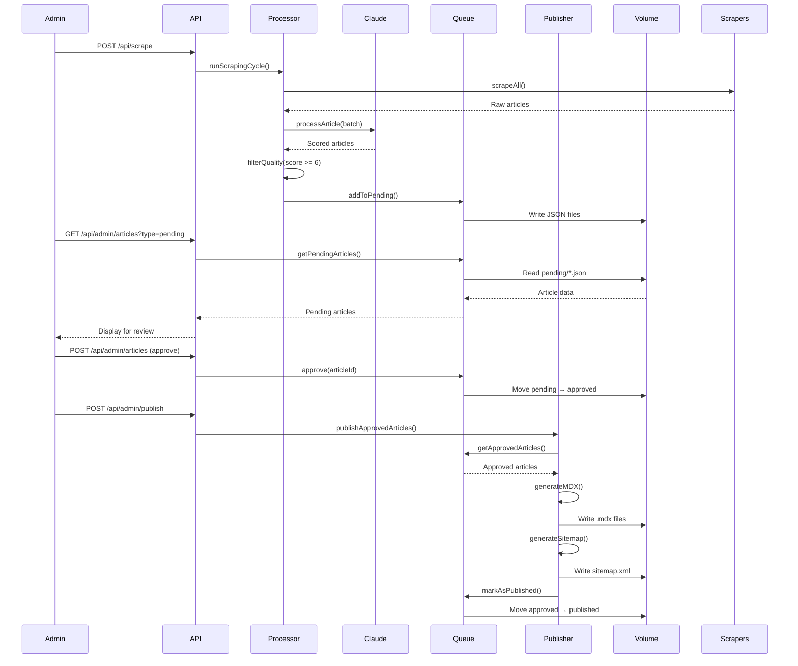

# Architecture Overview

> **Complete system design, components, and technical architecture of TechPulse Daily**

**Version:** 2.0.0
**Last Updated:** January 2025
**Maintained By:** [Syntax] (Lead), [Gordon], [Flow]

---

## Table of Contents

1. [System Overview](#system-overview)
2. [Application Architecture](#application-architecture)
3. [Component Breakdown](#component-breakdown)
4. [Data Flow](#data-flow)
5. [Technology Stack](#technology-stack)
6. [Path Resolution System](#path-resolution-system)
7. [Rendering Strategy](#rendering-strategy)

---

## System Overview

TechPulse Daily is a **headless CMS-style AI news aggregator** built with Next.js 15 App Router, designed for containerized deployment.

### Core Principles

1. **Volume-based persistence** - All content and queues stored in mounted volumes
2. **Docker-first deployment** - Multi-stage builds for optimal performance
3. **AI-powered curation** - Claude AI processes and scores all content
4. **Approval workflow** - Human oversight before publishing
5. **GitOps friendly** - Infrastructure as code, version controlled

---

## Application Architecture

```
┌─────────────────────────────────────────────────────────────┐
│                     EXTERNAL SOURCES                        │
│  ┌──────────┐  ┌──────────┐  ┌───────────┐  ┌───────────┐ │
│  │ Reddit   │  │   RSS    │  │  Hacker   │  │  Manual   │ │
│  │   API    │  │  Feeds   │  │   News    │  │  Inputs   │ │
│  └────┬─────┘  └────┬─────┘  └─────┬─────┘  └─────┬─────┘ │
└───────┼─────────────┼──────────────┼──────────────┼────────┘
        └─────────────┴──────────────┴──────────────┘
                          │
                          ▼
    ┌──────────────────────────────────────────────────────┐
    │           APPLICATION LAYER (Next.js 15)             │
    │                                                       │
    │  ┌────────────────────────────────────────────────┐ │
    │  │         API Routes (/src/app/api/)             │ │
    │  │  ┌──────────┐  ┌───────────┐  ┌─────────────┐ │ │
    │  │  │ /scrape  │  │  /admin   │  │   /health   │ │ │
    │  │  └────┬─────┘  └─────┬─────┘  └──────────────┘ │ │
    │  └───────┼──────────────┼─────────────────────────┘ │
    │          │              │                            │
    │          ▼              ▼                            │
    │  ┌────────────────────────────────────────────────┐ │
    │  │       Core Business Logic (/src/lib/)          │ │
    │  │                                                 │ │
    │  │  ┌─────────────┐  ┌─────────────────────────┐ │ │
    │  │  │  Scrapers   │  │   ContentProcessor       │ │ │
    │  │  │  (Reddit,   │──│   - Orchestrates flow    │ │ │
    │  │  │   RSS, HN)  │  │   - Deduplication        │ │ │
    │  │  └─────────────┘  │   - Filtering            │ │ │
    │  │                   └────────┬────────────────┘ │ │
    │  │                            │                   │ │
    │  │                            ▼                   │ │
    │  │  ┌──────────────────────────────────────────┐ │ │
    │  │  │        Claude AI Client                  │ │ │
    │  │  │  - Quality scoring (0-10)                │ │ │
    │  │  │  - Summary generation                    │ │ │
    │  │  │  - FAQ extraction                        │ │ │
    │  │  │  - Tag assignment                        │ │ │
    │  │  └────────┬─────────────────────────────────┘ │ │
    │  │           │                                    │ │
    │  │           ▼                                    │ │
    │  │  ┌──────────────────────────────────────────┐ │ │
    │  │  │        Queue Manager                     │ │ │
    │  │  │  - Pending queue                         │ │ │
    │  │  │  - Approved queue                        │ │ │
    │  │  │  - Rejected queue                        │ │ │
    │  │  │  - Published archive                     │ │ │
    │  │  └────────┬─────────────────────────────────┘ │ │
    │  │           │                                    │ │
    │  │           ▼                                    │ │
    │  │  ┌──────────────────────────────────────────┐ │ │
    │  │  │        Publisher                         │ │ │
    │  │  │  - Generate MDX files                    │ │ │
    │  │  │  - Update sitemap.xml                    │ │ │
    │  │  │  - Update index.mdx                      │ │ │
    │  │  └────────┬─────────────────────────────────┘ │ │
    │  └───────────┼──────────────────────────────────┘ │
    └──────────────┼────────────────────────────────────┘
                   │
                   ▼
    ┌──────────────────────────────────────────────────────┐
    │       PERSISTENT STORAGE (Volume-mounted)            │
    │                                                       │
    │  /app/data/                                          │
    │  ├── queue/                                          │
    │  │   ├── pending/      ← Articles awaiting review   │
    │  │   ├── approved/     ← Ready to publish           │
    │  │   ├── rejected/     ← Declined articles          │
    │  │   └── published/    ← Archive                    │
    │  │                                                   │
    │  └── content/                                        │
    │      └── posts/        ← Generated MDX files        │
    │          ├── 2025-01-15-article-slug.mdx            │
    │          └── 2025-01-16-another-article.mdx         │
    └──────────────────────────────────────────────────────┘
```

---

## Component Breakdown

### 1. **Scrapers** (`src/lib/scrapers/`)

| Scraper | Source | Key Features |
|---------|--------|--------------|
| **Reddit** | Subreddits | Score-based filtering, deduplication |
| **RSS** | Tech blogs | Multi-source aggregation, caching |
| **HackerNews** | HN API | Top stories, comment analysis |

**Adapter Pattern:** All scrapers implement `IContentScraper` interface:
```typescript
interface IContentScraper {
  scrape(): Promise<Article[]>;
  validateSource(): boolean;
}
```

**Path:** `src/lib/adapters/scrapers/`

---

### 2. **Content Processor** (`src/lib/processor.ts`)

**Responsibilities:**
- Orchestrate scraping cycle
- Process articles with Claude AI (batches of 3)
- Apply quality filters (score ≥ 6)
- Keyword matching (AI-related terms)
- Deduplicate by URL and title similarity
- Add to pending queue

**Key Methods:**
```typescript
class ContentProcessor {
  async runScrapingCycle(): Promise<ScrapingResult>
  private async processWithClaude(articles: Article[]): Promise<ProcessedArticle[]>
  private filterQualityArticles(articles: ProcessedArticle[]): ProcessedArticle[]
  private deduplicateArticles(articles: Article[]): Article[]
}
```

---

### 3. **Claude AI Client** (`src/lib/claude/client.ts`)

**Purpose:** Process raw articles into structured, scored content

**AI Prompt Structure:**
```typescript
{
  system: "You are a tech news analyst...",
  content: {
    task: "Analyze article and provide:",
    required: [
      "Quality score (0-10)",
      "Summary (Key Takeaway, Why It Matters, Brief Context)",
      "Tags (5-7 relevant keywords)",
      "FAQs (3-5 questions)"
    ]
  }
}
```

**Response Format:**
```json
{
  "qualityScore": 8.5,
  "summary": "...",
  "tags": ["AI", "GPT", "Claude"],
  "faq": [
    {"question": "What is...?", "answer": "..."}
  ]
}
```

---

### 4. **Queue Manager** (`src/lib/storage/queue.ts`)

**Persistence Strategy:** File-based JSON storage in mounted volume

**Queue States:**
```typescript
enum QueueState {
  Pending = 'pending',      // Awaiting admin review
  Approved = 'approved',    // Ready for publishing
  Rejected = 'rejected',    // Declined by admin
  Published = 'published'   // Live on site
}
```

**File Naming:** `{timestamp}-{article-id}.json`

**Key Methods:**
```typescript
class QueueManager {
  async addToPending(article: ProcessedArticle): Promise<void>
  async getPendingArticles(): Promise<Article[]>
  async approve(articleId: string): Promise<void>
  async reject(articleId: string): Promise<void>
  async markAsPublished(articleId: string): Promise<void>
}
```

---

### 5. **Publisher** (`src/lib/publisher.ts`)

**Purpose:** Convert approved queue items to publishable MDX files

**MDX Generation:**
```typescript
class Publisher {
  async publishApprovedArticles(): Promise<PublishResult> {
    const approved = await queue.getApprovedArticles();

    for (const article of approved) {
      // 1. Generate MDX content with frontmatter
      const mdx = this.generatePostContent(article);

      // 2. Write to /app/data/content/posts/
      fs.writeFileSync(filepath, mdx);

      // 3. Move to published archive
      await queue.markAsPublished(article.id);
    }

    // 4. Regenerate index and sitemap
    await this.generateIndex();
    await this.generateSitemap();

    return { published, errors };
  }
}
```

**Generated Files:**
- `YYYY-MM-DD-article-slug.mdx` → Individual posts
- `index.mdx` → Homepage content
- `sitemap.xml` → SEO sitemap

---

### 6. **Path Resolver** (`src/lib/shared/paths.ts`)

**Problem Solved:** Docker/volume path flexibility across environments

```typescript
export class PathResolver {
  static get contentDir(): string {
    return process.env.CONTENT_DIR || path.join(process.cwd(), 'content');
  }

  static get postsDir(): string {
    return path.join(this.contentDir, 'posts');
  }

  static get dataDir(): string {
    return process.env.DATA_DIR || path.join(process.cwd(), 'data');
  }

  static get queueDir(): string {
    return path.join(this.dataDir, 'queue');
  }
}
```

**Environment Variables:**
- `CONTENT_DIR=/app/data/content` → Published MDX files
- `DATA_DIR=/app/data` → Queue storage

**Why Important:** Allows same codebase to work in:
- Local development (`./data`)
- Docker containers (`/app/data` volume)
- Different hosting platforms (configurable paths)

---

## Data Flow

### Scraping → Publishing Flow



---

## Technology Stack

### Core Framework
- **Next.js 15.5.3** - React framework with App Router
- **React 19.1.0** - UI library
- **TypeScript 5.x** - Type safety

### AI & Processing
- **Anthropic SDK** (`@anthropic-ai/sdk`) - Claude AI integration
- **Cheerio** - HTML parsing for web scraping
- **RSS Parser** - Feed aggregation

### Content Sources
- **Snoowrap** - Reddit API client
- **RSS Parser** - Multi-source RSS feeds
- **Hacker News API** - HN integration

### Utilities
- **bcryptjs** - Password hashing
- **node-cron** - Scheduled tasks (future)

### Development
- **Tailwind CSS 4.x** - Styling
- **ESLint** - Code linting
- **Docker** - Containerization

---

## Rendering Strategy

### Current: Incremental Static Regeneration (ISR)

```typescript
// src/app/page.tsx
export const revalidate = 0; // Force fresh data every request
```

**Why `revalidate = 0`?**

1. **Docker Build Issue:**
   - During `npm run build`, homepage pre-renders with empty posts
   - Volume not mounted during build → MDX files don't exist yet
   - ISR cache persists → shows "No articles published yet"

2. **Solution:**
   - `revalidate = 0` forces server-side rendering every request
   - Always reads current MDX files from mounted volume
   - No stale cache issues

**Alternative Approaches (Tested):**
- ❌ `dynamic = 'force-dynamic'` → Causes 500 errors (fs module incompatible)
- ❌ `revalidate = 60` → Stale cache for 60 seconds
- ✅ `revalidate = 0` → Works with fs module, always fresh

---

## Security Architecture

### Authentication
- **bcryptjs** password hashing
- **Session-based** auth (cookies)
- **API key** middleware for internal endpoints

### Authorization
```typescript
// src/lib/auth/authMiddleware.ts
export function requireAuth(handler: Function) {
  return async (req: NextRequest) => {
    const apiKey = req.headers.get('x-api-key');
    if (apiKey !== 'admin-session-key') {
      return NextResponse.json({ error: 'Unauthorized' }, { status: 401 });
    }
    return handler(req);
  };
}
```

### Rate Limiting
- **Per-source delays** (1-2s between API calls)
- **Batch processing** (3 articles per Claude request)
- **Queue-based** throttling

---

## Scalability Considerations

### Current Architecture
- **Single container** - Suitable for <10k daily visitors
- **Volume persistence** - Survives restarts
- **Stateless app** - Can scale horizontally (future)

### Scaling Path
1. **Horizontal scaling** - Multiple container instances
2. **Database migration** - SQLite/PostgreSQL for queue
3. **CDN integration** - Cache static content
4. **Redis caching** - Session store, rate limiting
5. **Message queue** - RabbitMQ/SQS for async processing

---

## Debugging & Observability

### Built-in Endpoints
- `GET /api/health` - Health check
- `POST /api/admin/debug` - Directory inspection
- `POST /api/admin/debug-env` - Environment variables

### Logging
```typescript
// Throughout codebase
console.log('[Processor] Scraped X articles');
console.error('[Publisher] Error writing MDX:', error);
```

**Future:** Structured logging (Winston, Pino)

---

## File System Layout

```
Container Filesystem:
/app/
├── .next/              # Next.js build output
├── public/             # Static assets (from git)
│   ├── images/
│   └── sitemap.xml     # Auto-generated
├── config/             # Configuration (from git)
│   ├── sources.json
│   └── site.json
├── data/               # VOLUME MOUNTED - Persistent
│   ├── queue/
│   │   ├── pending/
│   │   ├── approved/
│   │   ├── rejected/
│   │   └── published/
│   └── content/
│       └── posts/      # Generated MDX files
├── server.js           # Next.js standalone server
└── package.json
```

---

## Next Steps

After understanding this architecture:
1. Read [Environment Setup](./02-environment-setup.md)
2. Review [Docker Deployment](./03-docker-deployment.md)
3. Study [Content Pipeline](./07-content-pipeline.md)

---

**Maintained By:** [Syntax], [Gordon], [Flow]
**Version:** 2.0.0
**Last Updated:** January 2025
