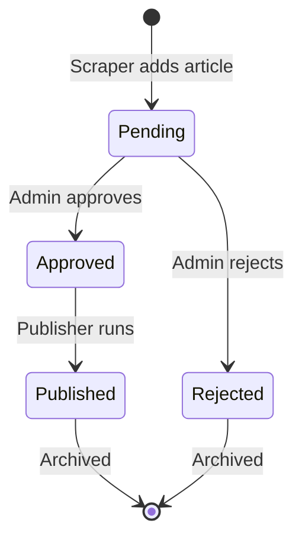

# Data Management

> **Storage patterns, queues, and persistence strategy**

**Version:** 2.0.0
**Last Updated:** January 2025
**Maintained By:** [Syntax], [Gordon]

---

## Table of Contents

1. [Storage Architecture](#storage-architecture)
2. [Queue System](#queue-system)
3. [Content Storage](#content-storage)
4. [Path Resolution](#path-resolution)
5. [Data Lifecycle](#data-lifecycle)
6. [Backup & Recovery](#backup--recovery)

---

## Storage Architecture

### Volume-Based Persistence

**Core Principle:** All dynamic data stored in a **single mounted volume** to survive container restarts and deployments.

```
/app/data/                    ← VOLUME MOUNT POINT
├── queue/                    ← Article workflow queues
│   ├── pending/              ← Awaiting admin review
│   ├── approved/             ← Ready to publish
│   ├── rejected/             ← Declined articles
│   └── published/            ← Archive of published
└── content/                  ← Generated content
    ├── posts/                ← Published MDX files
    └── index.mdx             ← Auto-generated homepage
```

**Why Volume Mount?**
- ✅ **Survives container restarts** - Data persists through crashes
- ✅ **Survives deployments** - New container versions keep data
- ✅ **Decouples data from code** - Git doesn't track generated content
- ✅ **Enables rollbacks** - Can redeploy old code without losing data

---

## Queue System

### File-Based Queue Implementation

**Location:** `src/lib/storage/queue.ts`

**Design Decision:** Files over database for simplicity and portability.

**Advantages:**
- ✅ No database setup required
- ✅ Easy to inspect (just cat/ls files)
- ✅ Portable across platforms
- ✅ Simple backup (copy directory)
- ✅ Human-readable JSON

**Trade-offs:**
- ⚠️ Not suitable for high concurrency (>100 writes/sec)
- ⚠️ No ACID transactions
- ⚠️ Manual cleanup required

---

### Queue States & Transitions



**State Definitions:**

| State | Directory | Purpose | Actions Available |
|-------|-----------|---------|-------------------|
| **Pending** | `queue/pending/` | Awaiting human review | Approve, Reject |
| **Approved** | `queue/approved/` | Ready for publishing | Publish, Unapprove |
| **Rejected** | `queue/rejected/` | Declined by admin | Delete, Reconsider |
| **Published** | `queue/published/` | Live on site (archive) | Delete |

---

### File Naming Convention

**Pattern:** `{timestamp}-{article-id}.json`

**Example:** `1705329600000-openai-gpt-4-5-release.json`

**Components:**
- `{timestamp}` - Unix milliseconds (for sorting)
- `{article-id}` - URL-safe slug derived from title

**Benefits:**
- Natural chronological sorting
- Unique filenames (timestamp + ID)
- Easy to identify at a glance

---

### Article JSON Structure

**File:** `queue/pending/1705329600000-article-slug.json`

```json
{
  "id": "openai-gpt-4-5-release",
  "title": "OpenAI Releases GPT-4.5 with Vision",
  "summary": "Key Takeaway: OpenAI has released GPT-4.5...",
  "url": "https://openai.com/blog/gpt-4-5",
  "source": "OpenAI Blog",
  "sourceType": "rss",
  "author": "OpenAI Team",
  "publishedAt": "2025-01-15T10:00:00.000Z",
  "scrapedAt": "2025-01-15T10:05:23.468Z",
  "qualityScore": 9.2,
  "score": 150,
  "tags": ["AI", "GPT", "OpenAI", "Vision", "Multimodal"],
  "content": "Full article text...",
  "engagement": {
    "upvotes": 150,
    "shares": 45,
    "comments": 67
  },
  "faq": [
    {
      "question": "What is GPT-4.5?",
      "answer": "GPT-4.5 is the latest..."
    }
  ]
}
```

**Required Fields:**
- `id` - Unique identifier
- `title` - Article headline
- `url` - Source URL
- `publishedAt` - Original publish date
- `qualityScore` - Claude AI score (0-10)

**Optional Fields:**
- `faq` - Generated Q&A pairs
- `engagement` - Social metrics
- `content` - Full article text

---

### QueueManager API

**File:** `src/lib/storage/queue.ts`

```typescript
class QueueManager {
  // Add article to pending queue
  async addToPending(article: ProcessedArticle): Promise<void>

  // Retrieve articles by state
  async getPendingArticles(): Promise<Article[]>
  async getApprovedArticles(): Promise<Article[]>
  async getRejectedArticles(): Promise<Article[]>
  async getPublishedArticles(): Promise<Article[]>

  // State transitions
  async approve(articleId: string): Promise<void>
  async reject(articleId: string): Promise<void>
  async markAsPublished(articleId: string): Promise<void>

  // Cleanup operations
  async deleteArticle(articleId: string, state: QueueState): Promise<void>
  async clearQueue(state: QueueState): Promise<void>
}
```

**Usage Example:**
```typescript
import { QueueManager } from '@/lib/storage/queue';

const queue = new QueueManager();

// Add to pending
await queue.addToPending(processedArticle);

// Get all pending
const pending = await queue.getPendingArticles();

// Approve article
await queue.approve('article-id-here');

// Get all approved
const approved = await queue.getApprovedArticles();
```

---

## Content Storage

### MDX File Generation

**Location:** `data/content/posts/*.mdx`

**Generated By:** `src/lib/publisher.ts`

**File Naming:** `YYYY-MM-DD-article-slug.mdx`

**Example:** `2025-01-15-openai-releases-gpt-4-5.mdx`

---

### MDX Structure

```markdown
---
title: "OpenAI Releases GPT-4.5 with Vision"
description: "Key Takeaway: OpenAI has released..."
publishedAt: "2025-01-15T10:00:00.000Z"
scrapedAt: "2025-01-15T10:05:23.468Z"
source: "OpenAI Blog"
sourceType: "rss"
author: "OpenAI Team"
url: "https://openai.com/blog/gpt-4-5"
score: 150
qualityScore: 9.2
tags: ["AI","GPT","OpenAI","Vision","Multimodal"]
slug: "openai-releases-gpt-4-5-with-vision"
---

<script type="application/ld+json">
{
  "@context": "https://schema.org",
  "@type": "Article",
  "headline": "OpenAI Releases GPT-4.5 with Vision",
  "description": "...",
  "author": {"@type": "Person", "name": "OpenAI Team"},
  "publisher": {
    "@type": "Organization",
    "name": "TechPulse Daily",
    "url": "https://techpulsedaily.app"
  },
  "datePublished": "2025-01-15T10:00:00.000Z",
  "url": "https://techpulsedaily.app/posts/openai-releases-gpt-4-5-with-vision"
}
</script>

# OpenAI Releases GPT-4.5 with Vision

<div className="article-meta">
  <span className="source">Source: <a href="...">OpenAI Blog</a></span>
  <span className="date">Published: January 15, 2025</span>
  <span className="quality">Quality Score: 9.2/10</span>
</div>

## Summary

Key Takeaway: OpenAI has released GPT-4.5...

## Key Takeaways

- Point 1
- Point 2
- Point 3

## Tags

<span className="tag">#AI</span> <span className="tag">#GPT</span>

---

**Want to dive deeper?** [Read the full article](https://openai.com/blog/gpt-4-5)
```

**Components:**
1. **Frontmatter** - Metadata in YAML format
2. **Schema.org JSON-LD** - SEO structured data
3. **Article Content** - Markdown with React components
4. **Meta Information** - Source, date, quality score
5. **Tags** - Categorization

---

### Auto-Generated Files

#### `index.mdx`

**Purpose:** Homepage content listing

**Generated By:** `publisher.generateIndex()`

**Contains:**
- Latest 10 articles
- Sorted by publish date
- With frontmatter and links

**Regenerated:** Every time articles are published

---

#### `public/sitemap.xml`

**Purpose:** SEO sitemap for search engines

**Generated By:** `publisher.generateSitemap()`

**Contains:**
```xml
<?xml version="1.0" encoding="UTF-8"?>
<urlset xmlns="http://www.sitemaps.org/schemas/sitemap/0.9">
  <url>
    <loc>https://techpulsedaily.app</loc>
    <lastmod>2025-01-15</lastmod>
    <changefreq>daily</changefreq>
    <priority>1.0</priority>
  </url>
  <url>
    <loc>https://techpulsedaily.app/posts/article-slug</loc>
    <lastmod>2025-01-15</lastmod>
    <changefreq>weekly</changefreq>
    <priority>0.8</priority>
  </url>
</urlset>
```

**Regenerated:** Every time articles are published

**Important:** Submit to Google Search Console after changes

---

## Path Resolution

### PathResolver Class

**File:** `src/lib/shared/paths.ts`

**Problem Solved:** Flexible paths across local/Docker/production environments

```typescript
export class PathResolver {
  // Base directory (process.cwd())
  static get baseDir(): string {
    return process.env.APP_ROOT || process.cwd();
  }

  // Data storage root
  static get dataDir(): string {
    return process.env.DATA_DIR || path.join(this.baseDir, 'data');
  }

  // Content root
  static get contentDir(): string {
    return process.env.CONTENT_DIR || path.join(this.baseDir, 'content');
  }

  // Published posts directory
  static get postsDir(): string {
    return path.join(this.contentDir, 'posts');
  }

  // Queue root
  static get queueDir(): string {
    return path.join(this.dataDir, 'queue');
  }

  // Individual queue directories
  static get pendingQueueDir(): string {
    return path.join(this.queueDir, 'pending');
  }

  static get approvedQueueDir(): string {
    return path.join(this.queueDir, 'approved');
  }
}
```

---

### Environment-Specific Paths

#### Local Development
```bash
# .env.local (optional - uses defaults)
DATA_DIR=./data
CONTENT_DIR=./content
```

**Resolved Paths:**
- `dataDir` → `./data`
- `contentDir` → `./content`
- `postsDir` → `./content/posts`
- `queueDir` → `./data/queue`

#### Docker Production
```bash
# Environment variables
DATA_DIR=/app/data
CONTENT_DIR=/app/data/content
```

**Resolved Paths:**
- `dataDir` → `/app/data` (volume-mounted)
- `contentDir` → `/app/data/content` (volume-mounted)
- `postsDir` → `/app/data/content/posts`
- `queueDir` → `/app/data/queue`

**Critical:** Both `DATA_DIR` and `CONTENT_DIR` must point to volume-mounted paths!

---

### Path Debugging

**Debug Endpoint:** `POST /api/admin/debug`

```bash
curl -X POST -H "x-api-key: admin-session-key" \
  "https://your-domain.com/api/admin/debug"
```

**Returns:**
```json
{
  "paths": {
    "postsDir": "/app/data/content/posts",
    "contentDir": "/app/data/content",
    "exists": {
      "postsDir": true,
      "contentDir": true
    },
    "files": {
      "postsDir": ["2025-01-15-article.mdx"],
      "contentDir": ["index.mdx", "posts"]
    }
  }
}
```

**Check for issues:**
- ❌ `postsDir: "/app/content/posts"` - Missing `/data/` (CONTENT_DIR not set)
- ❌ `exists.postsDir: false` - Directory doesn't exist
- ❌ `files.postsDir: []` - No MDX files generated

---

## Data Lifecycle

### Article Flow

```
1. Scraping
   ├─ Sources: Reddit, RSS, HackerNews
   └─ Output: Raw article data

2. AI Processing
   ├─ Claude analyzes content
   ├─ Generates quality score (0-10)
   ├─ Creates summary & FAQs
   └─ Assigns tags

3. Filtering
   ├─ Quality threshold: score >= 6
   ├─ Keyword matching
   └─ Deduplication

4. Queue → Pending
   ├─ Write JSON to queue/pending/
   └─ Wait for admin review

5. Admin Review
   ├─ Approve → queue/approved/
   └─ Reject → queue/rejected/

6. Publishing
   ├─ Read queue/approved/*.json
   ├─ Generate MDX files
   ├─ Write to content/posts/*.mdx
   ├─ Update index.mdx
   ├─ Update sitemap.xml
   └─ Move to queue/published/

7. Homepage Display
   ├─ Read content/posts/*.mdx
   ├─ Parse frontmatter
   ├─ Sort by date
   └─ Render cards
```

---

### Data Retention

**Queue Files:**
- `pending/` - Keep until approved/rejected
- `approved/` - Keep until published
- `rejected/` - Keep for 30 days (manual cleanup)
- `published/` - Keep indefinitely (archive)

**MDX Files:**
- Keep indefinitely (published content)
- Delete manually if needed

**Cleanup Script (Future):**
```bash
# Delete rejected articles older than 30 days
find /app/data/queue/rejected -name "*.json" -mtime +30 -delete
```

---

## Backup & Recovery

### Manual Backup

```bash
# Backup entire data directory
tar -czf techpulse-backup-$(date +%Y%m%d).tar.gz /app/data

# Upload to cloud storage
aws s3 cp techpulse-backup-*.tar.gz s3://your-bucket/backups/
```

### Restore

```bash
# Download backup
aws s3 cp s3://your-bucket/backups/techpulse-backup-20250115.tar.gz .

# Extract to volume
tar -xzf techpulse-backup-20250115.tar.gz -C /app/data

# Fix permissions
chown -R nextjs:nodejs /app/data
```

### Automated Backup (Recommended)

**Cron job on Docker host:**
```bash
0 2 * * * docker exec techpulse tar -czf /app/data/backup-$(date +\%Y\%m\%d).tar.gz /app/data && docker cp techpulse:/app/data/backup-*.tar.gz /backups/
```

---

## Storage Monitoring

### Disk Usage

```bash
# Check volume size
docker exec techpulse du -sh /app/data

# Breakdown by directory
docker exec techpulse du -sh /app/data/*

# File counts
docker exec techpulse find /app/data/queue -name "*.json" | wc -l
```

### Volume Health

```bash
# Docker volume info
docker volume inspect techpulse-data

# Check for corruption (filesystem check)
docker run --rm -v techpulse-data:/data alpine fsck /data
```

---

## Migration Guide

### Moving Between Environments

**Export from old:**
```bash
docker cp container-old:/app/data ./data-export
tar -czf data-export.tar.gz data-export
```

**Import to new:**
```bash
tar -xzf data-export.tar.gz
docker cp data-export container-new:/app/data
docker exec container-new chown -R nextjs:nodejs /app/data
```

### Database Migration (Future)

If scaling beyond file-based queues:

```sql
-- Queue table schema
CREATE TABLE articles (
  id VARCHAR(255) PRIMARY KEY,
  title TEXT NOT NULL,
  summary TEXT,
  state ENUM('pending','approved','rejected','published'),
  created_at TIMESTAMP DEFAULT CURRENT_TIMESTAMP,
  updated_at TIMESTAMP DEFAULT CURRENT_TIMESTAMP ON UPDATE CURRENT_TIMESTAMP,
  data JSON NOT NULL
);
```

---

## Best Practices

### DO ✅

1. **Always set `CONTENT_DIR` and `DATA_DIR`** in production
2. **Mount volumes** for persistence
3. **Regular backups** of `/app/data`
4. **Monitor disk usage** (alert at 80%)
5. **Test path resolution** with debug endpoint
6. **Verify permissions** (`chown nextjs:nodejs`)

### DON'T ❌

1. **Don't gitignore MDX files** if using git-based CMS workflow
2. **Don't store secrets** in queue files
3. **Don't manually edit** generated MDX files
4. **Don't delete published queue** files (archive)
5. **Don't exceed volume size** limit

---

## Troubleshooting

See [Troubleshooting Guide](./06-troubleshooting.md#volume--path-issues) for:
- Permission denied errors
- Path mismatch issues
- Empty queues despite files existing
- MDX files not appearing on homepage

---

**Maintained By:** [Syntax], [Gordon]
**Version:** 2.0.0
**Last Updated:** January 2025
