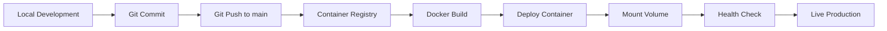

# TechPulse Daily - GitOps Documentation

> **Comprehensive developer guide for understanding, deploying, and troubleshooting TechPulse Daily**

**Version:** 2.0.0
**Last Updated:** January 2025
**Maintained By:** [Team]

---

## 📋 Table of Contents

### Core Documentation
1. **[Architecture Overview](./01-architecture.md)** - System design, components, and data flow
2. **[Environment Setup](./02-environment-setup.md)** - Local development and configuration
3. **[Docker Deployment](./03-docker-deployment.md)** - Containerization and CI/CD pipeline
4. **[Data Management](./04-data-management.md)** - Storage patterns, queues, and persistence
5. **[API Reference](./05-api-reference.md)** - Complete endpoint documentation
6. **[Troubleshooting Guide](./06-troubleshooting.md)** - Common issues and solutions

### Workflow Documentation
7. **[Content Pipeline](./07-content-pipeline.md)** - Scraping, processing, and publishing
8. **[Admin Operations](./08-admin-operations.md)** - Dashboard usage and management
9. **[Security Guide](./09-security.md)** - Authentication, authorization, and best practices

---

## 🎯 Quick Start

### For New Developers

1. **Clone the repository:**
   ```bash
   git clone https://github.com/travissutphin/techpulsedaily.app.git
   cd techpulsedaily.app
   ```

2. **Install dependencies:**
   ```bash
   npm install
   ```

3. **Set up environment:**
   ```bash
   cp .env.example .env.local
   # Edit .env.local with your API keys
   ```

4. **Run locally:**
   ```bash
   npm run dev
   # Visit http://localhost:3000
   ```

5. **Read the docs:**
   - Start with [Architecture Overview](./01-architecture.md)
   - Then [Environment Setup](./02-environment-setup.md)
   - Review [Content Pipeline](./07-content-pipeline.md)

---

## 🏗️ Technology Stack

| Component | Technology | Version | Purpose |
|-----------|-----------|---------|---------|
| **Framework** | Next.js | 15.5.3 | React framework with App Router |
| **Runtime** | Node.js | 18+ | JavaScript runtime |
| **Language** | TypeScript | 5.x | Type-safe development |
| **Styling** | Tailwind CSS | 4.x | Utility-first CSS |
| **AI Processing** | Claude (Anthropic) | Latest | Content analysis and generation |
| **Containerization** | Docker | 20.10+ | Multi-stage builds |
| **Content Sources** | RSS, Reddit, HN | N/A | Article aggregation |
| **Deployment** | Docker-based | N/A | Platform-agnostic containers |

---

## 📁 Project Structure

```
techpulsedaily.app/
├── src/
│   ├── app/                    # Next.js App Router pages
│   │   ├── api/               # API routes
│   │   │   ├── admin/        # Admin endpoints
│   │   │   └── scrape/       # Scraping triggers
│   │   ├── admin/            # Admin dashboard
│   │   └── page.tsx          # Homepage
│   ├── lib/                   # Core application logic
│   │   ├── adapters/         # External service adapters
│   │   ├── claude/           # AI processing
│   │   ├── scrapers/         # Content scrapers
│   │   ├── storage/          # Queue management
│   │   ├── shared/           # Shared utilities
│   │   ├── processor.ts      # Main processing pipeline
│   │   └── publisher.ts      # MDX generation
│   └── components/           # React components
├── data/                      # Persistent storage (mounted volume)
│   ├── queue/                # Article queues
│   │   ├── pending/
│   │   ├── approved/
│   │   ├── rejected/
│   │   └── published/
│   └── content/              # Generated MDX files
│       └── posts/
├── config/                    # Application configuration
│   ├── sources.json          # Content sources
│   └── site.json             # Site metadata
├── public/                    # Static assets
│   ├── images/
│   └── sitemap.xml           # Auto-generated
├── docs/                      # Documentation
│   └── gitops/               # GitOps documentation (this folder)
├── Dockerfile                 # Multi-stage Docker build
├── docker-entrypoint.sh      # Container startup script
└── package.json              # Dependencies and scripts
```

---

## 🔑 Key Concepts

### 1. **Content Pipeline**
Articles flow through: **Scraping** → **AI Processing** → **Queue** → **Approval** → **Publishing**

### 2. **Volume-Based Storage**
All persistent data (queues, published articles) stored in `/app/data` volume to survive container restarts.

### 3. **Docker Multi-Stage Build**
Optimized builds with separate stages for dependencies, building, and production runtime.

### 4. **ISR vs. Dynamic Rendering**
Homepage uses `revalidate = 0` to avoid Docker build cache issues with volume-mounted content.

### 5. **Path Resolution**
`PathResolver` class uses environment variables (`CONTENT_DIR`, `DATA_DIR`) for flexible deployment.

---

## 🚀 Deployment Workflow



**Platform Agnostic:** Works with Railway, AWS ECS, Google Cloud Run, Azure Container Instances, or any Docker host.

---

## 🔐 Environment Variables

**Required:**
- `CLAUDE_API_KEY` - Anthropic API key for AI processing
- `SITE_URL` - Production URL
- `CONTENT_DIR` - Path to content storage (default: `/app/data/content`)
- `DATA_DIR` - Path to data storage (default: `/app/data`)

**Optional:**
- `ADMIN_USERNAME` / `ADMIN_PASSWORD` - Admin dashboard credentials
- `REDDIT_CLIENT_ID` / `REDDIT_CLIENT_SECRET` - Reddit API access
- `NODE_ENV` - Environment mode (`development`, `production`)

See [Environment Setup](./02-environment-setup.md) for details.

---

## 🐛 Common Issues

### Homepage shows "No articles published yet"
**Cause:** Docker ISR cache or volume not mounted
**Solution:** See [Troubleshooting Guide](./06-troubleshooting.md#homepage-empty)

### 500 Internal Server Error
**Cause:** Missing environment variables or incorrect paths
**Solution:** Check `CONTENT_DIR` and `DATA_DIR` settings

### Articles not scraping
**Cause:** API credentials missing or source config issues
**Solution:** Verify `config/sources.json` and API keys

**Full troubleshooting:** [06-troubleshooting.md](./06-troubleshooting.md)

---

## 👥 Team Roles

- **[Syntax]** - Principal Engineer (Architecture, Core Logic)
- **[Codey]** - Technical Program Manager (Process, Coordination)
- **[Aesthetica]** - Frontend Developer & UI/UX (Components, Styling)
- **[Flow]** - DevOps Engineer (Docker, CI/CD, Deployment)
- **[Gordon]** - Docker Engineer (Containers, Orchestration)
- **[Sentinal]** - Security Specialist (Auth, Security Reviews)
- **[Verity]** - QA Engineer (Testing, Quality Assurance)
- **[Bran]** - Digital Marketing (SEO, AEO, Schema)
- **[Echo]** - Content Strategist (Editorial, Content Flow)

---

## 📚 Documentation Standards

All GitOps documentation follows these principles:

1. ✅ **Platform-agnostic** - No hosting provider references
2. ✅ **Docker-centric** - Focus on containerization
3. ✅ **Complete** - Everything needed to understand the app
4. ✅ **Troubleshooting-focused** - Common issues and solutions
5. ✅ **Versioned** - Track documentation changes
6. ✅ **Tested** - All commands verified working

---

## 🔄 Contributing to Documentation

When making changes to the application:

1. Update relevant docs in `docs/gitops/`
2. Increment version number in affected docs
3. Add entry to changelog
4. Commit docs with code changes

---

## 📖 Reading Order

**For new developers:**
1. This README
2. [Architecture Overview](./01-architecture.md)
3. [Environment Setup](./02-environment-setup.md)
4. [Content Pipeline](./07-content-pipeline.md)

**For deployment:**
1. [Docker Deployment](./03-docker-deployment.md)
2. [Data Management](./04-data-management.md)
3. [Troubleshooting Guide](./06-troubleshooting.md)

**For debugging:**
1. [Troubleshooting Guide](./06-troubleshooting.md)
2. [API Reference](./05-api-reference.md)
3. [Architecture Overview](./01-architecture.md)

---

## 📞 Support

**Issues:** Report in GitHub Issues
**Documentation Bugs:** `docs/gitops/` pull requests
**Security:** See [Security Guide](./09-security.md)

---

**Last Updated:** January 2025
**Maintainers:** [Team]
**License:** Private
